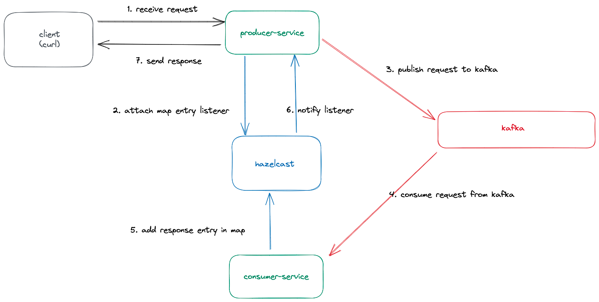

# README #

## Overview

This respository is a poc for processing a synchronous http request asynchronously, using kafka and hazelcast. 

In the demo, client will send a request to producer service which will attach a listener in Hazelcast distributed map and
publish the request to kafka. The request is consumed by consumer service and its response is added
in a distributed Hazelcast map. This notifies the listener in producer service and response to the http request is 
sent back to client.



We use Hazelcast's [Distributed map](https://docs.hazelcast.com/hazelcast/5.3/data-structures/map) and [EntryAddedListener](https://docs.hazelcast.com/imdg/4.2/events/object-events#listening-for-map-events)
The code for attaching the listener and adding entry in hazelcast map is present in `src/main/java/com/fyndna/hazelcastdemo/service/TransactionService.java` class


## Prerequisites

- Docker and Docker Compose
- Java JDK 17
- Gradle 
- Dapr CLI 

## Execution Steps

### 1. Start Infrastructure

Start Hazelcast and Kafka:

```bash
make start-infra
```


### 2. Start the Producer

Start the hazelcast-demo-producer service:
```bash
make start-producer
```

### 3. Start the Consumer

Start the hazelcast-demo-consumer service:
```bash
make start-consumer
```

### 4. Send a Transaction

To send a transaction, run:

```bash
make start-txn
```

### 5. Stop Infrastructure

To stop hazelcast and kafka

```bash
make stop-infra
```
